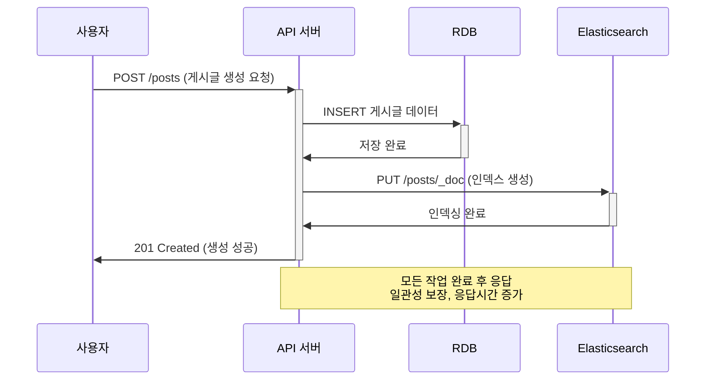
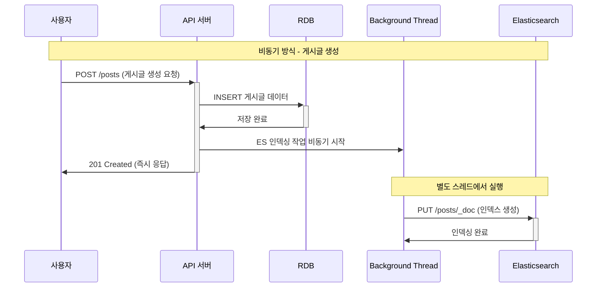
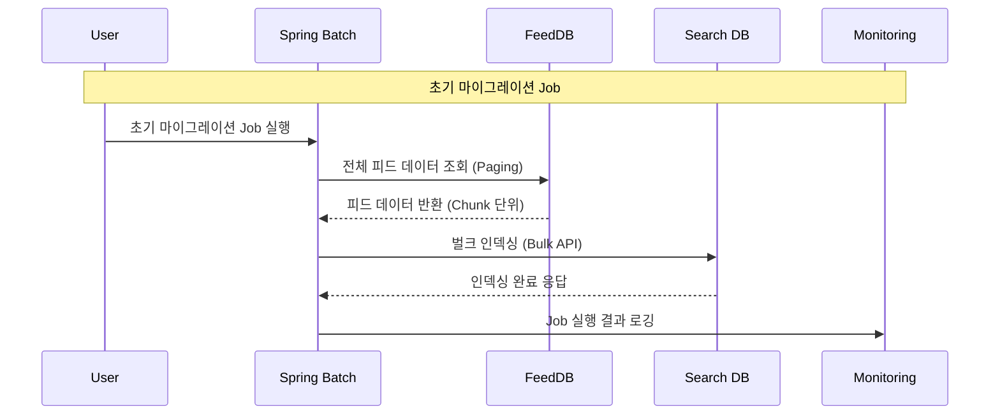
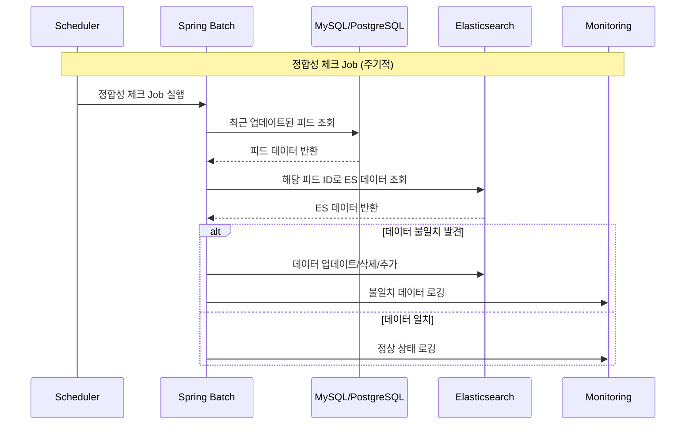
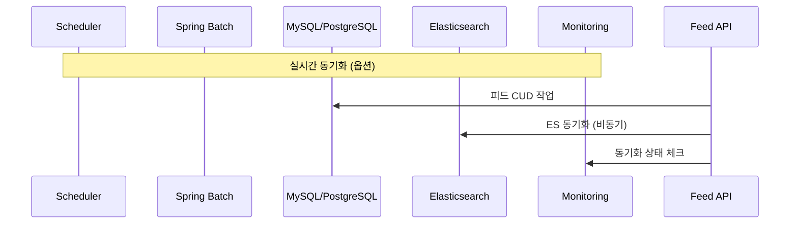

## 들어가며


### to-be 구조.
사용하고자하는 구조는 다음과 같음.


(이미지.)

데이터는 RDB-ES 검색에 필요한 일부데이터는 ES에서 관리할 예정. 같은 데이터이지만, 서로 다른목적을 가지기 때문에 분리했음. 


키워드에 대한 본문, 제목 검색을 ES에서 postId를 넘겨주면
RDB에서 나머지 필요한 정보들 정리해서 넘겨주는 방식. 

- 인덱스 설계 
- 데이터 수정, 삭제 시 동기화를 어떻게 할 것인지? 
- 페이지네이션 어떻게 할 건지?
- 테스트 어떻게 할 것인지? 


### 어떻게 인덱스를 설계할 것인지?

인덱스 이름 정의가 필요 ES에서 인덱스는 RDB에서 table에 해당되는 구조임. 
이때 RDB 처럼 스키마와 비슷한 느낌의 매핑정보를 같이 지정해줘야함. 
이 매핑 정보의 역할은 추후 검색시에 정확한 타입정보를 인지하기 위함임. 


현재 게시글에서 검색에 사용할 필드는 다음과 같은 정보가 필요할 것으로 보임. 
- postID -> 리턴값으로 필요 
- title
- content
- 작성자
- 생성일, 

이를 기준으로 ES에서 사용할 인덱스를 생성해야함. 
매핑 정보.
추가로 인덱스에 alias를 붙일 수 있음. 
Elasticsearch에서 **alias(별칭)**는 하나 이상의 인덱스에 붙일 수 있는 **가상의 이름**임. 
별칭을 통해 다음과 같은 작업들을 수행할 수 있음. 
- 실제 인덱스 이름 대신 alias로 검색, 색인, 삭제 작업 가능
- alias는 **무중단 인덱스 교체** 시 주로 사용됨
- alias에 필터나 라우팅 설정도 가능해 유연성 제공
따라서 인덱스는 별칭을 통해 버저닝 관리를 하려고함.
- 인덱스 버전 관리(`post-v1`, `post-v2` 등) 시, 애플리케이션은 항상 동일한 alias(`post-index`)만 참조
- 신규 인덱스를 만들고 데이터 이관 후 alias를 옮기면, 서비스 중단 없이 인덱스 교체 가능


ID 값에 대한 고민, 나중에 RDB와도 동기화를 해줄 것이기 때문에, 자동 생성이 가능하지만, 동기화를 고려해서 PK 값을 인덱스 pk 값과 동일하게 일치.


Spring Data-ES 에서는 `@Document` 로  이름을 지정해줄 수 있음. JPA에서 `@Entity`하는 것과 비슷하다고 생각하면됨(JPA는 아님)
도큐먼트는 RDB 에서 하나의 행을 이루는 단위로 매핑하면 이해가 쉬움. 하나의 인덱스안에 여러 도큐먼트가 저장된다고 이해. 


자동 생성은 안함.

- 자동 생성 시 매핑이나 설정이 의도와 다르게 생성될 위험
- 복잡한 분석기 설정, 샤드 수 조정 등 운영 최적화 불가능
- 스키마 변경 관리 및 버전 관리 어려움
- 데이터 무결성, 성능 문제 발생 가능성

- `@Setting`에 JSON 설정을 넣어도,
- 실제 인덱스는 **배포 파이프라인이나 스크립트로 직접 생성/관리**    
- 자동 생성 기능은 끄고, 안정적 인덱스 관리가 최우선입니다.

1. **필요한 필드만 색인(index)**
	- `index: true`인 필드는 **검색 가능**하게 되지만, 색인을 만들기 때문에 디스크를 더 많이 사용하고 색인 시간이 길어짐. 
	- 따라서 **검색에 사용되지 않는 필드는 `index: false`로 설정**하여 불필요한 색인을 방지함.
2. **정렬용은 doc_values 사용**
	- `doc_values`는 **정렬, 집계, 스크립트에서 사용**되는 별도의 컬럼 지향 데이터 저장 구조임.
	- 대부분의 **`keyword`, `numeric`, `date` 필드**에는 자동으로 `doc_values: true`가 적용됨.
	- 하지만 `text` 필드는 기본적으로 `doc_values: false`라 정렬/집계용으로는 적합하지 않음.  
	    → 이 경우 `keyword` 서브필드 사용.


인덱스 생성 
`put`  `/{index name}`


## Spring 연동

spring-data-elasticsearch


## 검색 로직 


Query 
search


ES 검색 API
```json
GET 

```


https://12bme.tistory.com/589


## 데이터 동기화 방식 : RDB ↔ ES간의 데이터 일관성 맞추기

검색 기능을 고도화하면서, ES를 도입하면서 가장 고민이 되었던 부분은 이 부분. 

현재 구조, 원본 데이터는 RDB에 저장하고,검색에 필요한 일부 필드 데이터를 ES에서 관리하며 검색기능을 제공하는 방식을 취하고 있음. 현재 구조에서는 동일한 데이터가 여러 곳에 위치하기 때문에 데이터 일관성 문제가 발생할 수 있음. 

예를 들면 게시글이 새로 생성되거나 수정, 삭제될 때, 적절하게 검색시스템(ES) 반영되지 않으면 사용자는 발행한 게시글을 검색하지 못하거나, 수정되기 이전 데이터를 검색 결과로 받아 볼 수 있는 문제가 발생함. 

그래서 크게 데이터가 변경될 때(생성, 수정, 삭제) 필요한 작업이 2가지로 나뉠 수 있음. 
- 데이터의 변경 작업. 
- 변경된 데이터의 검색 시스템 반영 작업 

이후에 이를 구현하기 위한 고민 포인트들은 다음과 같았음. 
- 사용자에게 검색시스템 반영 여부가 주요한가? (비동기 처리 가능 여부)
- 사용자에게 검색시스템 반영 속도가 민감한가? (준실시간 처리 가능 여부)

### 동기? 비동기?

첫번째 고민은 검색시스템 반영을 반드시 동기로 처리되어야하는지, 비동기로 처리되어도 괜찮은지? 에 대한 고민이었음. 
- 만일 게시글을 수정될때, 검색시스템(ES)에 반영하는 로직이 꼭 함께 실행되어야하는지? (데이터 일관성 수준)
- ES에 반영하는 로직이 실패한다면 게시글 수정의 실패로 봐야하는가? (부분 실패 가능 여부)
- 내가 사용자라면 게시글 수정 시간이 느린 것보다 검색 서비스에 바로 안뜨는 것이 더 허용 가능한지? (사용자 경험)
### 동기 방식



동기 방식의 경우에는 검색시스템(ES)에 데이터의 변경이 완료될때까지 기다리게 된다. 그래서 게시글을 수정했을 경우, 사용자는  


- 쓰기 연산은 ES에 부담이 되는 연산.
- 실패할 경우 모두 실패가 됨. 

동기 방식의 경우 구현 자체는 간단함. 시스템 복잡도가 크게 올라가지 않음. 
트랜잭션 롤백이 어려움. -> ES의 경우 트랜잭션이 없기 때문에. 
- 트랜잭션 관리에 대한 부분
- 예외 처리에 대한 전략
- 재시도 및 복구 전략
	- **즉시 복구**: 실패한 ES 작업을 즉시 재시도
	- **배치 복구**: 주기적으로 불일치 데이터 감지하여 복구
	- **수동 복구**: 관리자가 직접 데이터 정합성 복구


### 비동기 방식



비동기 방식은 한 작업이 끝날때까지 기다리지 않고 다음 작업을 바로 처리함. 때문에 비동기 방식을 사용할 경우에 검색시스템 반영이 끝날때까지 기다리지 않고, 바로 다음 작업을 처리할 수 있음. 

- 빠른 응답, 일시적 불일치 가능


### 검색 서비스(ES) 데이터 연동을 위한 비동기 방식들

여러가지 방법들이 존재.


비동기 스레드 활용.

메시지 큐 활용.

트랜잭션 아웃 박스 패턴.

이벤트 스트리밍.

배치 사용 방식.

CDC.


이 게시글이 얼마나 빨리 반영되어야하는가도 고려해야할 포인트였음. 만일 게시글의 수정 상태가 거의 즉시(=실시간)으로 반영되어야 하는지, 아니면 수분 내로 반영되면 되는지, 이 결정에 따라서 취해야하는 방식과 구조가 달라질 것 같았기 때문.

검색 서비스의 경우 게시글의 변경 시점과 거의 동일한 수준으로 반영되어야 할 필요는 없다고 판단. 사용자는 게시글 수정 완료를 빨리 확인하고 싶어하고, 검색에 몇 초 늦게 반영되는 것은 보통 허용 가능한 수준이기 때문에. 아마 검색에 노출되는 것이 사용자에게 매우 중요하다는 비즈니스 요구사항이 있다면 달라질 것 같음. 

https://americanopeople.tistory.com/334


결정한 방법은 비동기 스레드를 활용하여 ES 체크는 비동기로 처리. 


## 마이그레이션과 데이터 정합성 체크

초기 1번은 데이터 이관이 필요하다. 

스프링 배치를 통해서 마이그레이션 작업을 수행. 

초기 1회 Job을 여러개 두어서 활용. 




`JpaPagingItemReader`는 **Spring Batch**에서 사용하는 `ItemReader`로, JPA를 통해 **페이징 기반으로 데이터를 읽어오는 리더**입니다. 대량의 데이터를 메모리에 한꺼번에 올리는 대신, **지정된 사이즈만큼 쿼리로 나눠서 읽을 수 있도록** 도와줍니다.

- `Pageable`을 이용해 JPA로 **페이징 쿼리** 실행
- `EntityManager`를 사용 (트랜잭션 필수)
- 기본적으로 **영속성 컨텍스트 공유**

스텝 구성. 
JpaQueryProvider`는 **Spring Batch**에서 `JpaPagingItemReader`나 `JpaCursorItemReader`
에 사용할 수 있는 **JPA 쿼리 생성기 인터페이스**입니다. 동적 쿼리나 재사용 가능한 쿼리 객체를 만들 때 사용합니다.




요거까지 완료.





