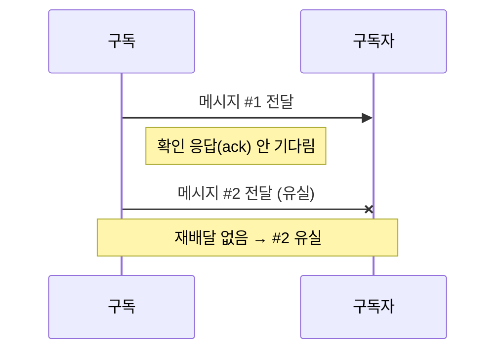
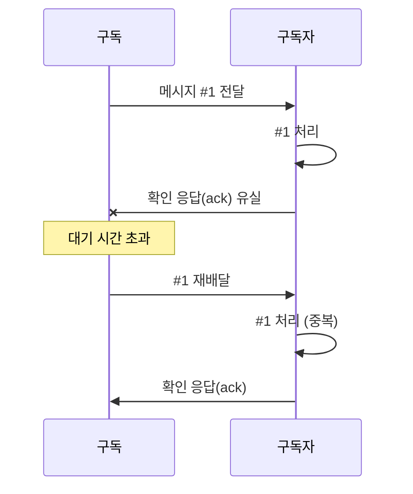
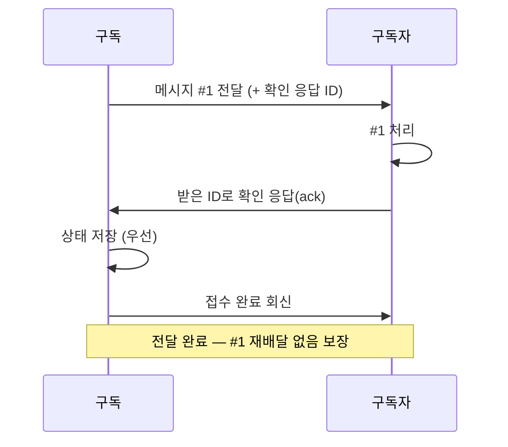

메시지를 주고 받을 때 메시지를 주고 받는 과정에서 '이 정도의 메시지 전달 수준을 보장한다'를 표현하는 수준을 의미하는 개념이 존재한다. 

크게 3가지로 나뉜다. 이 3가지 보장 수준을 통해서 이 메시지 시스템에 어떻게 동작하는지 파악이 가능하다. 이를 통해 메시지를 주고받을때 발생하는 중복처리나, 데이터 유실 문제를 어떻게 핸들링할지 결정하는데 참고할 수 있는 개념이다. 

| 보장 수준 | 도착 횟수 (최소~최대) | 재배달 | 보장 수준 | 복잡성 |
|---|---|---|---|---|
| At most once | 0 ~ 1 | 없음 | 유실 가능 | 낮음 |
| At least once | 1 ~ N | 있음 | 유실 없음, 중복 가능 | 중간 (확인 응답이 필요) |
| Exactly once | 1 ~ 1 | 있음 | 유실·중복 없음 | 높음 (중복을 걸러내기 위한 상태 관리까지 필요) |

위에서 아래로 갈수록 보장 수준은 이상적이며, 달성하기 어려워진다. 

---

### At most once 

직역하면 "최대 한 번" 이다. 메시지가 최소 0번 혹은 최대 1번 전달할 수 있음을 의미한다. 최소 0번이라는 경우에는 메시지가 유실될 수 있음을 의미한다. 이는 중간에 메시지가 도착하지 않아도, 이를 위한 재배달을 하지 않음을 의미한다. 

그렇기 때문에 메시지의 유실이 큰 문제가 되지 않는 경우의 문제에서는 이 전달 보장 수준으로도 충분할 수 있다. 예를 들면 로그를 전송하거나, 유실이 큰 문제가 되지 않는 경우에 적합하다. 

> 택배를 시켰는데 집앞에 툭 던져놓고 가는 것을 상상해보자, 물건이 도둑맞아도 다시 배송해주지 않으면서 심지어 중간에 오다 잃어버려도 보상해주지 않는다. 가격이 싼 물건이어야 속이 안아프다.

---

### At least once 

최소 한번이다. 메시지가 적어도 1번 이상 전달될 수 있다는 것을 보장한다. 이 경우에는 메시지의 유실을 허락하지 않는 대신, 유실을 방지하기 위한 재시도 로직 등으로 인해 사용자에게 메시지가 여러번, 중복적으로 전달이 될 수 있음을 의미한다. 

이 경우에는 메시지를 받는 쪽에서는 데이터가 중복 처리되어도, 문제가 없도록, 데이터 처리로직을 멱등하게 작성하는 것이 중요하다. 

일반적인 메시지 처리에는 이 전달 수준이 대부분 적합하다. 메시지가 담고 있는 데이터가 유실되어서는 안되는 경우에 적합하다. 

> 상품을 배달받고 앱에서 "구매 확정"을 누르지 않을 경우 앱에서 "구매확정"을 누를때까지 동일한 상품이 문앞으로 계속 배달된다. 가끔은 "구매 확정"을 눌러도 그 사이 이미 상품이 와있을수도 있다.

---

### Exactly once

정확히 딱 한번. 메시지가 전달됨을 의미한다. 메시지가 유실되지도, 중복되지 않는 이상적인 전달 보장 수준이다. 

사실 개인적으로는 이부분이 제일 직관적으로 이해되지 않았는데, 재시도 없이 정확히 딱 1번만 메시지를 주고 받는것을 상상하면 이해가 어렵지만, 메시지가 중복처리 없이 한번에 처리되는 것을 목표하는 개념이라고 보면 조금 더 이해가 쉽다. 마치 외부에서보면 딱 한번만 메시지를 받아서 처리되는 것처럼 보인다 라고 이해하면 좋을 것 같다. 

이 경우에는 메시지가 정확하게 한번 처리되어야하는, 데이터의 정확성 중요하거나 중복이 발생해서는 안되는 상황에 지켜져야할 전달 보장 수준이 된다.

다만 확인 응답이 실패하거나 기한을 넘기면 재배달은 여전히 일어나므로, 구독자 쪽에서도 처리를 멱등하게 만들어야 한다.

> 기사님이 상품을 들고 직접 방문해서, 설치해서 잘쓰는지 확인하고, 수령확인서를 받아간다. 재배달 해달라 해도, 확인서가 있어 재배달되는 일이 없고, 상품도 잘 설치되어 있음을 보장한다.

GCP의 대표적인 메시징 서비스인 Pub/Sub 에서는 At least once / Exactly once(pull)수준의 메시지 전달 보장 수준을 지원한다. 
